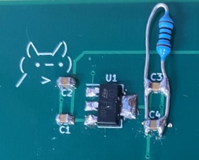

# Mux64-testboard

## The MUX64-Testboard is designed to monitor and test signals such as:
* Bias Voltage		&rarr; 	up to 1000V
* BPOL12V Output	&rarr; 	up to 1.2V 
* ETROC Output	&rarr; 	up to 1.2V
* LV input		&rarr;	up to 12V
* PTAT-BPOL12V	&rarr;	up to 2V
* VTRX+ RSSI Output	&rarr;	up to 2.5V 
* VTRX+ Power	&rarr;	up to 2.5V

## How It Works
Test signals would be inputs to the screw terminals. Their traces are then connected to the MUX64 chip which will be used to monitor their behavior. The select pins for the MUX64 come from the RB connector's digital pins. The output of the MUX64 is connected to a RB connector analog pin.

## Power 
The board is powered through the RB connectors bringing in ~9V which is then sent through a voltage regulator to convert into 1.2V which is then used to power the MUX64 chip. There is also a voltage reference for ~0.6V that is sent to a  MUX64 input, analog input on the RB connector, and is a test-point on the board.

### v1.0
Modifications made to physical board:
* Regultor has an addd 100ohm resistor to have a constant load even when MUX64 is not connected (This change helps the regulator maintain a 1.2V otput at all times)
+ 100ohm image: 
* A trace that started from the output of voltage divider was removed and reconnected to the input of the voltage divider. Also pins 5 and 6 of voltage regulator were shorted together (This changed the voltage refrence to now output ~0.6V and not 1.2V because the MUX64 and RB can only read voltages from 0-2V) 
